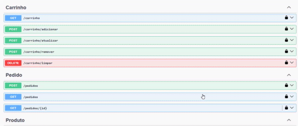

# LojaVirtualAPI

API RESTful desenvolvida em ASP.NET Core para gerenciamento de uma loja virtual, com autenticação JWT, CRUD de usuários, produtos, carrinho e pedidos.

---

## Tecnologias utilizadas

- .NET 7 (ou versão que estiver usando)
- Entity Framework Core (Code First)
- JWT Authentication
- Swagger para documentação e testes
- SQL Server (local ou Azure)
- C#

---

## Funcionalidades

- Cadastro e login de usuários com segurança por hash de senha e token JWT
- Gerenciamento de produtos com operações CRUD
- Controle de estoque e status ativo/inativo dos produtos
- Carrinho de compras com itens e cálculo de valores
- Registro e gerenciamento de pedidos
- Documentação e testes via Swagger UI

---

## Como executar o projeto

### Pré-requisitos

- [.NET SDK](https://dotnet.microsoft.com/en-us/download)
- SQL Server local ou remoto configurado
- Visual Studio 2022 / VS Code ou IDE de sua preferência

### Passos

1. Clone o repositório

```bash
git clone https://github.com/cnthigu/LojaVirtualAPI.git
cd LojaVirtualAPI
